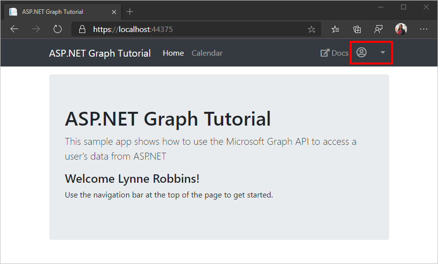

<!-- markdownlint-disable MD002 MD041 -->

When the user signs in to the sample application, the right-hand side of the navigation bar displays a placeholder user avatar. In this procedure, you'll update the application to replace the placeholder with the user's profile photo from Microsoft Graph.

Here's what the application navigation bar looks like before adding the user's photo.



1. Open the **graph-tutorial.sln** file in Visual Studio, then open **Helpers/GraphHelper.cs**.
1. Add the following `using` statements at the top of the file.

    ```csharp
    using System.IO;
    using System;
    ```

1. Add the following function to the `GraphHelper` class to get the user's photo and encode it as a data URI.

    ```csharp
    public static async Task<string> GetUserPhotoAsDataUriAsync(GraphServiceClient graphClient = null, string size = null)
    {
       if (graphClient == null)
       {
             graphClient = GetAuthenticatedClient();
       }

       Stream photoStream;

       // If no size specified, get the default photo
       if (string.IsNullOrEmpty(size))
       {
             photoStream = await graphClient.Me
                .Photo.Content.Request().GetAsync();
       }
       else
       {
             photoStream = await graphClient.Me
                .Photos[size].Content.Request().GetAsync();
       }

       // Copy the stream to a MemoryStream to get the data
       // out as a byte array
       var memoryStream = new MemoryStream();
       photoStream.CopyTo(memoryStream);

       var photoBytes = memoryStream.ToArray();

       // Return a data URI
       return $"data:image/png;base64,{Convert.ToBase64String(photoBytes)}";
    }
    ```

1. Add the following to the `GetUserDetailsAsync` function before the `return` statement.

    ```csharp
    // Get the user's profile photo
    var profilePhotoUri = await GetUserPhotoAsDataUriAsync(graphClient, "48x48");
    ```

1. Replace the `Avatar = string.Empty,` line in the `GetUserDetailsAsync` function with the following.

    ```csharp
    Avatar = profilePhotoUri,
    ```

1. Save all of your changes, then select **Debug** > **Start Debugging** or press **F5** to run the application.
1. Sign into the application using the **Click here to sign in** button or the **Sign In** navigation bar link.

After successfully signing in, you should see the user's profile photo in the upper right corner. If you still see the placeholder, make sure that your user account has a profile photo by signing in at [https://www.office.com](https://www.office.com).


