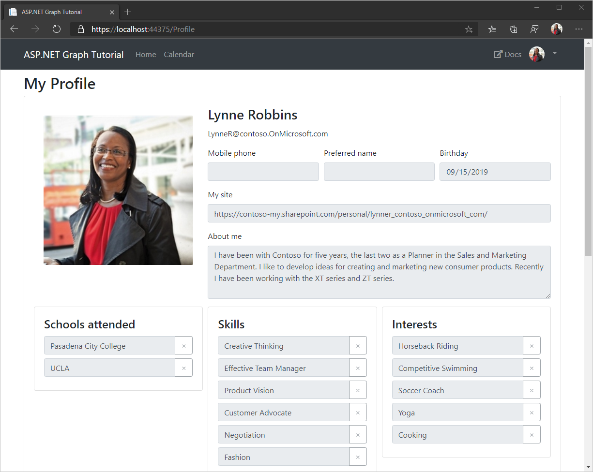

<!-- markdownlint-disable MD002 MD041 -->

Now let's add a profile page to the app, and use Microsoft Graph to fill it in.

1. In **Helpers/GraphHelper.cs**, add the following function to get the user's profile.

    ```csharp
    public static async Task<User> GetUserProfileAsync()
    {
        var graphClient = GetAuthenticatedClient();

        // The default set of properties on a user object is small,
        // you must request non-default properties explicitly
        var userProfile = await graphClient.Me
            .Request()
            .Select(u => new
            {
                u.AboutMe,
                u.Birthday,
                u.BusinessPhones,
                u.City,
                u.Country,
                u.Department,
                u.DisplayName,
                u.EmployeeId,
                u.Interests,
                u.JobTitle,
                u.MobilePhone,
                u.MySite,
                u.OfficeLocation,
                u.PostalCode,
                u.Responsibilities,
                u.Schools,
                u.Skills,
                u.State,
                u.StreetAddress
            })
            .GetAsync();

        return userProfile;
    }
    ```

1. In the **Solution Explorer** in Visual Studio, select the **Controllers** folder.
1. Open the context menu by right-clicking the **Controllers** folder or pressing **SHIFT** + **F10**.
1. Select **Add** > **Controller...**.
1. Select **MVC 5 Controller - Empty** and choose **Add**. Name the controller `ProfileController` and choose **Add**.
1. Open the **ProfileController.cs** file and replace its entire contents with the following code.

    ```csharp
    using graph_tutorial.Helpers;
    using graph_tutorial.Models;
    using System.Threading.Tasks;
    using System.Web.Mvc;

    namespace graph_tutorial.Controllers
    {
        public class ProfileController : BaseController
        {
            // GET: Profile
            [Authorize]
            public async Task<ActionResult> Index()
            {
                // Temporary
                ViewBag.ConsentUri = string.Empty;

                var userPhoto = await GraphHelper.GetUserPhotoAsDataUriAsync();
                ViewBag.FullSizePhoto = userPhoto;

                var userProfile = await GraphHelper.GetUserProfileAsync();

                return View(userProfile);
            }
        }
    }
    ```

## Add views

Let's implement a view for the user's profile, and a partial view for the parts of the user's profile that are lists.

1. In **Solution Explorer**, expand the **Views** folder, then select the **Shared** folder.
1. Open the context menu for the **Profile** folder and choose **Add** > **MVC 5 Partial Page (Razor)**.
1. Name the page `_ModifiableList` and choose **OK**.
1. Open the **_ModifiableList.cshtml** file and add the following code.

    ```cshtml
    @model List<string>
    @{
        var canUpdate = (bool)ViewData["canUpdate"];
    }

    <div class="card">
        <div class="card-body">
            <h4 class="card-title">@ViewData["title"]</h4>
            @foreach (var item in Model)
            {
                <div class="input-group mb-2">
                    <input type="text" form="@ViewData["form"]" class="form-control existing-item-input" name="@ViewData["name"]" value="@item" @{ @(canUpdate ? null : new { disabled = "disabled" })  } ; />
                    <div class="input-group-append">
                        <button type="button" class="btn btn-outline-secondary remove-button" @{ @(canUpdate ? null : new { disabled = "disabled" })  } ;>
                            <span>&times;</span>
                        </button>
                    </div>
                </div>
            }
            @if (canUpdate)
            {
                <div class="input-group">
                    <input type="text" class="form-control new-item-input" data-name="@ViewData["name"]" placeholder="@ViewData["placeholder"]" />
                    <div class="input-group-append">
                        <button class="btn btn-secondary add-new-item" type="button">+</button>
                    </div>
                </div>
            }
        </div>
    </div>
    ```

1. In **Solution Explorer**, expand the **Views** folder, then select the **Profile** folder.
1. Open the context menu for the **Profile** folder and choose **Add** > **MVC 5 View Page (Razor)**.
1. Name the page `Index` and choose **OK**.
1. Open the **Index.cshtml** file and add the following code.

    ```cshtml
    @model Microsoft.Graph.User

    @{
        ViewBag.Title = "Index";
        var canUpdate = ViewBag.ConsentUri == null;
    }

    <h2>My Profile</h2>

    <form id="profile-form" action="/Profile/Update" method="post"></form>
    <form id="photo-form" action="/Profile/UpdatePhoto" method="post" enctype="multipart/form-data"></form>

    <div class="card mb-4" id="user-card">
        <div class="card-body">
            <div class="form-row">
                <div class="col-md-4">
                    <div class="card-body">
                        
                        <div class="custom-file mb-1">
                            <input type="file" form="photo-form" class="custom-file-input" id="profilePhoto" name="profilePhoto" accept="image/jpeg, image/png" @{ @(canUpdate ? null : new { disabled = "disabled" })  } ; />
                            <label for="profilePhoto" class="custom-file-label">Choose new photo</label>
                        </div>
                        <button type="submit" form="photo-form" class="btn btn-primary btn-block">Update my photo</button>
                    </div>
                </div>
                <div class="col-md-8">
                    <h3 class="card-title">@ViewBag.User.DisplayName</h3>
                    <p class="card-text">@ViewBag.User.Email</p>
                    <div class="form-row">
                        <div class="form-group col-md-4">
                            <label for="mobilePhone">Mobile phone</label>
                            <input type="tel" form="profile-form" class="form-control" id="mobilePhone" name="mobilePhone" value="@Model.MobilePhone" @{ @(canUpdate ? null : new { disabled = "disabled" })  } ; />
                            <input type="hidden" form="profile-form" name="originalMobilePhone" value="@Model.MobilePhone" />
                        </div>
                        <div class="form-group col-md-4">
                            <label for="preferredName">Preferred name</label>
                            <input type="text" form="profile-form" class="form-control" id="preferredName" name="preferredName" value="@Model.PreferredName" @{ @(canUpdate ? null : new { disabled = "disabled" })  } ; />
                            <input type="hidden" form="profile-form" name="originalPreferredName" value="@Model.PreferredName" />
                        </div>
                        <div class="form-group col-md-4">
                            <label for="birthday">Birthday</label>
                            <input type="date" form="profile-form" class="form-control" id="birthday" name="birthday" value="@Model.Birthday.Value.ToString("yyyy-MM-dd")" @{ @(canUpdate ? null : new { disabled = "disabled" })  } ; />
                            <input type="hidden" form="profile-form" name="originalBirthDay" value="@Model.Birthday.Value.ToString("yyyy-MM-dd")" />
                        </div>
                    </div>
                    <div class="form-group">
                        <label for="mySite">My site</label>
                        <input type="url" form="profile-form" class="form-control" id="mySite" name="mySite" value="@Model.MySite" @{ @(canUpdate ? null : new { disabled = "disabled" })  } ; />
                        <input type="hidden" form="profile-form" name="originalMySite" value="@Model.MySite" />
                    </div>
                    <div class="form-group">
                        <label for="aboutMe">About me</label>
                        <textarea class="form-control" form="profile-form" id="aboutMe" name="aboutMe" rows="4" @{ @(canUpdate ? null : new { disabled = "disabled" })  } ;>@Model.AboutMe</textarea>
                        <input type="hidden" form="profile-form" name="originalAboutMe" value="@Model.AboutMe" />
                    </div>
                </div>
            </div>

            <div class="form-row row-cols-1 row-cols-md-3">
                <div class="col mb-4">
                    @Html.Partial("_ModifiableList", Model.Schools, new ViewDataDictionary { { "title", "Schools attended" }, { "form", "profile-form" }, { "placeholder", "Add a school" }, { "name", "schools[]" }, { "canUpdate", canUpdate } })
                    <input type="hidden" form="profile-form" name="originalSchools" value="@string.Join(";", Model.Schools.ToArray())" />
                </div>
                <div class="col mb-4">
                    @Html.Partial("_ModifiableList", Model.Skills, new ViewDataDictionary { { "title", "Skills" }, { "form", "profile-form" }, { "placeholder", "Add a skill" }, { "name", "skills[]" }, { "canUpdate", canUpdate } })
                    <input type="hidden" form="profile-form" name="originalSkills" value="@string.Join(";", Model.Skills.ToArray())" />
                </div>
                <div class="col mb-4">
                    @Html.Partial("_ModifiableList", Model.Interests, new ViewDataDictionary { { "title", "Interests" }, { "form", "profile-form" }, { "placeholder", "Add an interest" }, { "name", "interests[]" }, { "canUpdate", canUpdate } })
                    <input type="hidden" form="profile-form" name="originalInterests" value="@string.Join(";", Model.Interests.ToArray())" />
                </div>
            </div>
            @if (canUpdate)
            {
                <div class="text-right">
                    <button type="submit" form="profile-form" class="btn btn-primary">Update my info</button>
                </div>
            }
            else
            {
                <div class="alert alert-primary">
                    We don't have permission to update your profile. Click <a href="@ViewBag.ConsentUri">here</a> to grant permission.
                </div>
            }
        </div>
    </div>
    <div class="card mb-4" id="workInfo">
        <div class="card-body">
            <h3 class="card-title">Work information</h3>
            <form>
                <div class="form-row">
                    <div class="form-group col-md-4">
                        <label for="workPhone">Work phone</label>
                        <input type="tel" class="form-control" id="workPhone" name="workPhone" value="@Model.BusinessPhones.FirstOrDefault()" readonly />
                    </div>
                    <div class="form-group col-md-4">
                        <label for="employeeId">Employee ID</label>
                        <input type="text" class="form-control" id="employeeId" name="employeeId" value="@Model.EmployeeId" readonly />
                    </div>
                </div>
                <div class="form-group">
                    <label for="streetAddress">Street address</label>
                    <input type="text" class="form-control" id="streetAddress" name="streetAddress" value="@Model.StreetAddress" readonly />
                </div>
                <div class="form-row">
                    <div class="form-group col-md-6">
                        <label for="city">City</label>
                        <input type="text" class="form-control" id="city" name="city" value="@Model.City" readonly />
                    </div>
                    <div class="form-group col-md-4">
                        <label for="state">State</label>
                        <input type="text" class="form-control" id="state" name="state" value="@Model.State" readonly />
                    </div>
                    <div class="form-group col-md-2">
                        <label for="postalCode">Postal code</label>
                        <input type="text" class="form-control" id="postalCode" name="postalCode" value="@Model.PostalCode" readonly />
                    </div>
                </div>
                <div class="form-row">
                    <div class="form-group col-md-4">
                        <label for="department">Department</label>
                        <input type="text" class="form-control" id="department" value="@Model.Department" readonly />
                    </div>
                    <div class="form-group col-md-4">
                        <label for="jobTitle">Job title</label>
                        <input type="text" class="form-control" id="jobTitle" value="@Model.JobTitle" readonly />
                    </div>
                    <div class="form-group col-md-4">
                        <label for="officeLocation">Office location</label>
                        <input type="text" class="form-control" id="officeLocation" value="@Model.OfficeLocation" readonly />
                    </div>
                </div>
                <h4>Responsibilities</h4>
                <ul class="list-group">
                    @foreach (var item in Model.Responsibilities)
                    {
                        <li class="list-group-item">@item</li>
                    }
                </ul>
            </form>
        </div>
    </div>

    @section Scripts
    {
        <script src="https://cdn.jsdelivr.net/npm/bs-custom-file-input/dist/bs-custom-file-input.min.js"></script>
        <script src="~/Scripts/FormInput.js"></script>
        <script src="~/Scripts/ModifiableList.js"></script>
    }
    ```

1. Open the **Views/Shared/_Layout.cshtml** file.
1. Add the following code after the `<div class="dropdown-divider"></div>` line.

    ```cshtml
    @Html.ActionLink("My Profile", "Index", "Profile", new { area = "" }, new { @class = "dropdown-item" })
    ```

1. Save all of your changes, then select **Debug** > **Start Debugging** or press **F5** to run the application.
1. Sign into the application using the **Click here to sign in** button or the **Sign In** navigation bar link.
1. Select the user's profile photo, then select **My Profile** in the drop-down menu.


