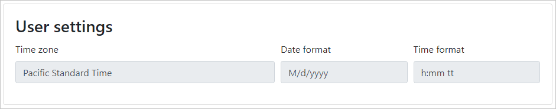

<!-- markdownlint-disable MD002 MD041 -->

Now let's get the user's mailbox settings. These settings contain the user's chosen time zone and preferred formats for dates and times. We can use this information to further personalize the application to the user's preferences.

1. Open **TokenStorage/SessionTokenStore.cs** and update the `CachedUser` class to add new properties.

    ```csharp
    public class CachedUser
    {
        public string DisplayName { get; set; }
        public string Email { get; set; }
        public string Avatar { get; set; }
        public string TimeZone { get; set; }
        public string DateFormat { get; set; }
        public string TimeFormat { get; set; }
    }
    ```

1. Open **Helpers/GraphHelper.cs** and locate the `GetUserDetailsAsync` function.
1. Modify the parameters to the `Select` function in the call to get the user to add `u.MailboxSettings` to the list of requested properties. The new function call should look like this:

    ```csharp
    // Get the user's details from Graph
    // We only want displayName, mail,
    // mailboxSettings, and userPrincipalName
    var user = await graphClient.Me.Request()
        .Select(u => new {
            u.DisplayName,
            u.Mail,
            u.MailboxSettings,
            u.UserPrincipalName
        })
        .GetAsync();
    ```

1. Modify the `return new CachedUser` statement to set additional properties from the mailbox settings.

    ```csharp
    return new CachedUser
    {
        Avatar = profilePhotoUri,
        DateFormat = user.MailboxSettings.DateFormat,
        DisplayName = user.DisplayName,
        // Personal accounts don't have their mail property set
        // In this case, fallback on userPrincipalName
        Email = string.IsNullOrEmpty(user.Mail) ?
            user.UserPrincipalName : user.Mail,
        TimeFormat = user.MailboxSettings.TimeFormat,
        TimeZone = user.MailboxSettings.TimeZone
    };
    ```

1. Open **Views/Profile/Index.cshtml** and add the following code after the last `</div>` tag.

    ```cshtml
    <div class="card mb-4" id="settings">
        <div class="card-body">
            <h3 class="card-title">User settings</h3>
            <form>
                <div class="form-row">
                    <div class="form-group col-md-6">
                        <label for="timeZone">Time zone</label>
                        <input type="text" class="form-control" id="timeZone" value="@ViewBag.User.TimeZone" readonly />
                    </div>
                    <div class="form-group col-md-3">
                        <label for="dateFormat">Date format</label>
                        <input type="text" class="form-control" id="dateFormat" value="@ViewBag.User.DateFormat" readonly />
                    </div>
                    <div class="form-group col-md-3">
                        <label for="timeFormat">Time format</label>
                        <input type="text" class="form-control" id="timeFormat" value="@ViewBag.User.TimeFormat" readonly />
                    </div>
                </div>
            </form>
        </div>
    </div>
    ```

1. Open **PrivateSettings.config** and add `MailboxSettings.Read` to the `ida:Scopes` key.

    ```xml
    <add key="ida:AppScopes" value="User.Read Calendars.Read MailboxSettings.Read" />
    ```

1. Save all of your changes, then select **Debug** > **Start Debugging** or press **F5** to run the application.
1. Sign into the application using the **Click here to sign in** button or the **Sign In** navigation bar link.
1. Select the user's profile photo, then select **My Profile** in the drop-down menu. At the bottom of the profile page, the user's mailbox settings are displayed.


